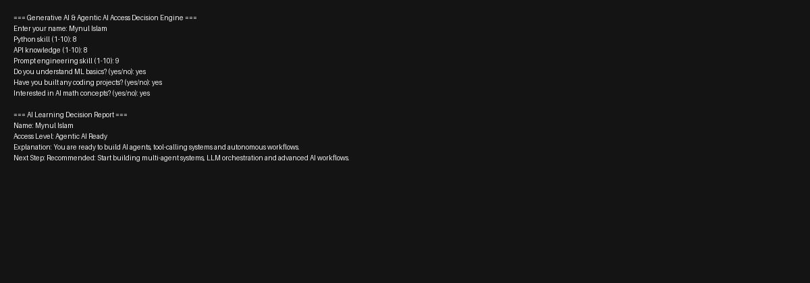

# AI Readiness Rule Engine

A small Python decision engine that uses **conditional statements** to evaluate a learner’s readiness for **Generative AI, Agentic AI and multi-agent system development** based on core prerequisites such as Python skills, API knowledge, prompt engineering ability and ML basics.

### Concepts Covered
Conditional statements (`if`, `elif`, `else`), nested conditions, logical operators (`and`), comparison operators, user input (`input()`), type conversion (`int`) and basic rule-based decision logic.

### Run
```bash
python ai_readiness_engine.py
```

## Example Output

